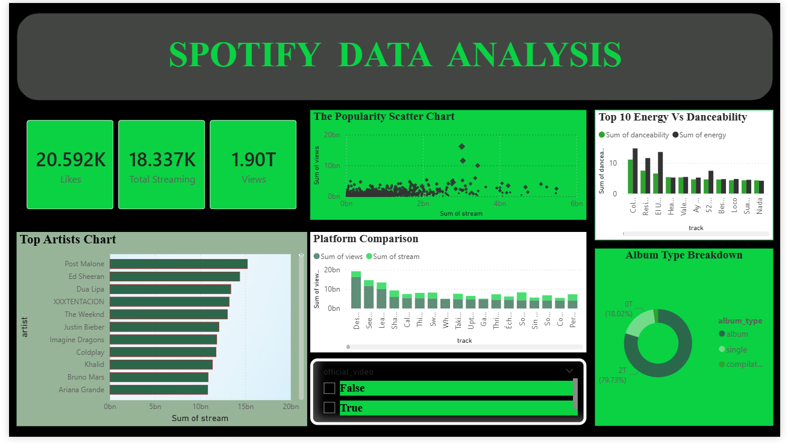

# Spotify-Data-Analysis-SQL-PowerBI
## Project Overview
This project analyzes a Spotify dataset containing over 20,000 records to uncover trends in streaming, social media engagement, and platform performance.

## Tools Used
* **SQL (PostgreSQL):** For data cleaning and complex querying.
* **Power BI:** For building an interactive performance dashboard.

## Key Insights
* **Official vs. Non-Official:** Official music videos average X% higher likes than unofficial tracks.
* **Platform Dominance:** Identified which artists perform better on YouTube vs. Spotify using cross-platform metrics.

## How to View the Dashboard
1. Download the `.pbix` file.
2. Open it in Power BI Desktop to interact with the slicers and visuals.

